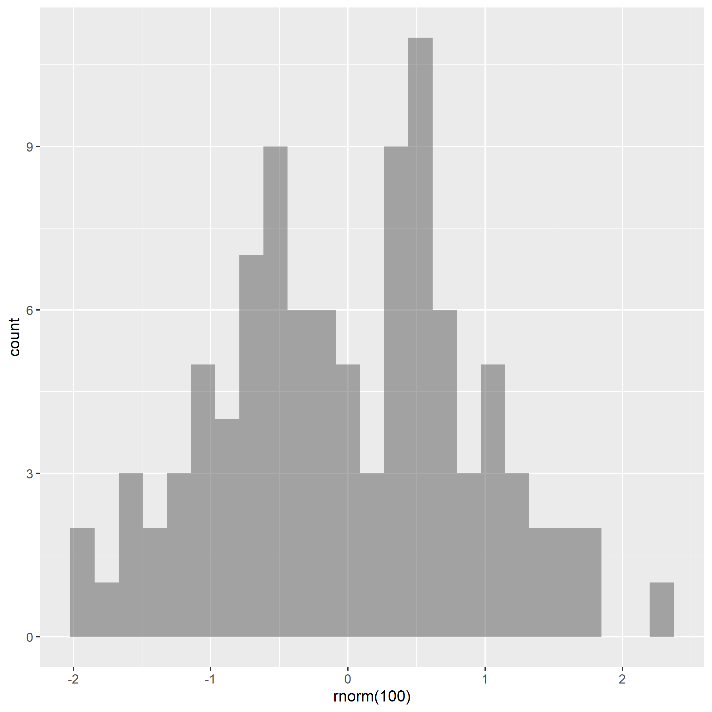

<!-- You can add the slide options to the entire presentation or individual slides. The link at the end of this presentation has a good overview of how customize your presentation and links to pages with more details for most sections. --->


```{r}
#| label: setup
#| include: false

library(tidyverse)
library(mosaic)
library(ggformula)

gamer <- read_csv("Esports_Study_Data.csv")
nerds <- gamer |> 
  filter(Game %in% c("Casual-SB", "Elite-SB"))
```

<!-- This is a rough outline of the types of slides you will want to create. See the Project Description page on Canvas for complete descriptions of what you need to include -->

<!--- Note: you will want to replace my instructions with your actual responses on each slide --->


## Motivation (you can change titles)

- Info on problem  
- More Info  
- May need 2-3 slides  


## Outline

- What are you about to cover in this talk

## Background  

- Relevant information to help us understand what has been done already
- Don't be afraid to include images 

{#id .class width=40% height=40%}


# Methods  
<!-- A single hashtag # will create a title type slide to create a clear distinction between sections of the presentation. -->

## Methods Slide 1 - Data Collection

- The participant collection included visiting local Monterey, San Jose, and CSUMB tournaments for esports, visiting the CSUMB library to ask people to join, and other non-random methods of obtaining participants.   
- This is a convenience sample. There is no scope of generalization.


## Methods Slide 2 - Analytic Methods

- Why did you use nonparametric methods?  
  
- A skew across groups.  
- The small sample size within groups. ($n_{casual}$ = 24, $n_{elite}$ = 19)  
- T-Distribution would not be trustworthy with these conditions.  


# Results

## Summary Statistics and Graphics

- variance: Casual-SB = 2976.918 ;Elite-SB = 7099.584 
```{r}
#data<-read_csv()
#include data in project file
#may need a few more slides for graphics
# add |> knitr::kable() to the end of code that outputs tables to make them clean and pretty
# examples: df_stats(Results~Group, data=df_data) |> knitr::kable()
gf_boxplot(Actual_Mean_Go_RT_ms~Game, data = nerds)

```

## Permutatation null distribution


```{r}
diff <- diff(mean(Actual_Mean_Go_RT_ms~Game, data = nerds))

N <- 10^4 - 1 #Shuffle 999 times

perm_diff <- numeric(N) #set up placeholder

for (i in 1:N) {
  
   perm_diff[i] <- diff(mean(Actual_Mean_Go_RT_ms~shuffle(Game), data = nerds))  #describe
}

gf_histogram(~perm_diff,
             xlab = "Difference between two means",
             ylab = "Number of permutations",
             title = "Null Distribution") #describe

p <- ((sum(~(perm_diff >= diff)) + 1)/(N + 1))
```
- P-value = `r p`

## Bootstrapping Confidence Interval

```{r}
noob <- nerds |> filter(Game %in% "Casual-SB")
pros <- nerds |> filter(Game %in% "Elite-SB")

diff_mean <- numeric(1000)

for (i in 1:1000) {
  
  noob_mean <- mean(~Actual_Mean_Go_RT_ms, data = resample(noob, replace = TRUE))
  pros_mean <- mean(~Actual_Mean_Go_RT_ms, data = resample(pros, replace = TRUE))
  diff_mean[i] <- noob_mean - pros_mean
}


gf_histogram(~diff_mean, 
             xlab = "Bootstrap Sample difference in means between casual gamers and elite gamers", 
             title = "Bootstrap Distribution of difference in sample means")

quantile(diff_mean, c(0.025,0.975)) |> knitr::kable()
```


## Analysis
Provide analysis using nonparametric methods
```{r}
#analysis code
```


# Summary  


## Conclusions  


## Future Work


## References

Be sure to also include citations within slides where necessary (especially in Motivation and Background, but may also be necessary in other places)


Learn more about formatting here [Revealjs presentations](https://quarto.org/docs/presentations/revealjs/)
