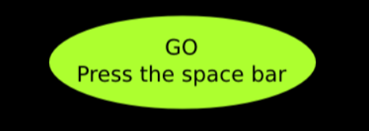
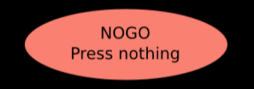

```{r}
#| label: setup
#| include: false
#| echo: false

library(tidyverse)
library(mosaic)
library(ggformula)

gamer <- read_csv("Esports_Study_Data.csv")
nerds <- gamer |> 
  filter(Game %in% c("Casual-SB", "Elite-SB")) |> 
  mutate(Game = recode(Game,
                       "Casual-SB" = "Casual SSBU",
                       "Elite-SB"  = "Elite SSBU"),
         Game = factor(Game, levels = c("Casual SSBU", "Elite SSBU")))
```
## Motivation

<style>
#title-slide h1 {
  font-size: 2em;
}
</style>

- Esports as a field requires accuracy where one thousandth of a second can determine whether a team or person wins. Skills like quick reaction times increase the chances of succeeding in faster paced video games which require these skills (Ersin at al. 2022).  
- A recent study (Ziv et. al., 2022) found evidence that asking participants about their gaming status (gamer or non-gamer) positively affected performance for gamers and had an adverse effect on non-gamers in cognitive motor task performance. 


## Outline

- 

## Background  

- In the growing Esports industry, competitive Super Smash Bros Ultimate (SSBU) players require quick reactions and timely responses to stimuli.
- Professional Esports athletes practice 5-10 hours per day, nearly consistent with traditional sports and more than their casual counterpart (Emara et al. 2020).

{#id .class width=40% height=40%}


# Methods  
<!-- A single hashtag # will create a title type slide to create a clear distinction between sections of the presentation. -->

## Methods - Data Collection 

- Participant collection included visiting local Monterey, San Jose, and CSUMB SSBU tournaments to ask people to join, and other non-random methods of obtaining participants.  
- Conducted computerized practice assessment to get them accustomed to the software and then the actual congitive test to collect data on impulsivity via the GO/NoGO test  
- Casual SSBU players (play at least 4 hours per week of the game), Elite SSBU players (ranked top 150 in the world)  


## Methods - Variable Creation

- Measure of reaction time to an
- Mean GO reaction time: Difference between the actual mean GO reaction time (ms) and the practice mean GO reaction time (ms).  
{#id .class width=40% height=40%}
{#id .class width=40% height=40%}

## Methods - Analytic Methods

- We are planning on running a permutation test to obtain our statistics  
- Followed by a bootstrap interval to obtain our CI

## Methods - Analytic Methods

*Why did you use nonparametric methods?*  
```{r histograms}
# examples: df_stats(Results~Group, data=df_data) |> knitr::kable()
ggplot(nerds) +
  geom_histogram(aes(x = Actual_Mean_Go_RT_ms)) +
  facet_wrap(~Game)+
  labs(y = "Frequency",
       x = "Mean GO Reaction Time (ms)",
       title = "Smash bros ultimate players in the MRY and SJ Counties") +
  theme()
```
- There is a skew within the small sample sized groups. ($n_{casual}$ = 24, $n_{elite}$ = 19)  
- T-Distribution would not be appropriate as a model of the null distribution with these conditions.  
- A permuted T-test would not be appropriate because the median 


# Results

## Summary Statistics and Graphics

- Boxplots of mean GO reaction time (ms) for smash bros ultimate players in the Monterey and San Jose Counties for casual SSBU players and for Elite SSBU players

```{r}
# examples: df_stats(Results~Group, data=df_data) |> knitr::kable()
ggplot(nerds) +
  geom_boxplot(aes(x = Actual_Mean_Go_RT_ms,
                   y = Game)) +
  labs(y = "Gamer type",
       x = "Mean GO Reaction Time (ms)",
       title = "Smash bros ultimate players in the MRY and SJ Counties") +
  theme()
```

# Non-parametric Analysis

## Permutatation null distribution

```{r}
differ <- diff(mean(Actual_Mean_Go_RT_ms~Game, data = nerds))

N <- 10^4 - 1 #Shuffle 999 times

perm_diff <- numeric(N) #set up placeholder

 for (i in 1:N) {
  
    perm_diff[i] <- diff(mean(Actual_Mean_Go_RT_ms~shuffle(Game), data = nerds))  #describe
 } #describe

p <- ((sum(~(perm_diff >= differ)) + 1)/(N + 1))
```

```{r null-dist}
gf_histogram(~perm_diff,
             xlab = "Difference between two means",
             ylab = "Number of permutations",
             title = "Null Distribution")
```

- P-value = `r p`

## Bootstrapping Confidence Interval

```{r bs-ci}
noob <- nerds |> filter(Game %in% "Casual SSBU")
pros <- nerds |> filter(Game %in% "Elite SSBU")

diff_mean <- numeric(1000)

 for (i in 1:1000) {
   
   noob_mean <- mean(~Actual_Mean_Go_RT_ms, data = resample(noob, replace = TRUE))
   pros_mean <- mean(~Actual_Mean_Go_RT_ms, data = resample(pros, replace = TRUE))
  diff_mean[i] <- noob_mean - pros_mean
 }


gf_histogram(~diff_mean, 
             xlab = "Bootstrap Sample difference in means between casual gamers and elite gamers", 
             title = "Bootstrap Distribution of difference in sample means")

lb <- quantile(diff_mean, 0.025)
ub <- quantile(diff_mean, 0.975)
```

- Confidence Interval : (`r lb`, `r ub`)  
- Include negative, zero and positive numbers.  
- Casual can have mean GO reaction time faster, slower, or equal to that of Elite. 


# Summary  


## Conclusions  

- There no significant difference in population means of mean GO reaction time (ms) for SSBU players that have competed in the Monterey and San Jose Counties for Casual SSBU and for Elite SSBU players. 
- Weak evidence against the null hypothesis (p-value = `r p`, $\alpha = 0.05$, $\bar{x}_{casual} - \bar{x}_{elite} =$ `r differ`).    
- 100% of Casual mean GO reaction time is contained within 100% of Elite mean GO reaction time.   
- Convenient sample contains bias, cannot generalize to all super smash bros ultimate players.

## Future Work

Include a random sample to generalize to the larger populations  

Delve into the other variables not included such as:  
  - Other game types  
  - Other measures of reaction time  
  - Controller specific reaction speed  

## References {.smaller}
-  Emara, Ahmed K., et al. “Gamer’s Health Guide: Optimizing Performance, Recognizing Hazards, and Promoting Wellness in Esports.” Current Sports Medicine Reports, vol. 19, no. 12, Dec. 2020, pp. 537–45. DOI.org (Crossref), https://doi.org/10.1249/JSR.0000000000000787.  
- Ersin, A., Tezeren, H., Pekyavas, N., Asal, B., Atabey, A., Diri, A., & Gonen, I. (2022). The relationship between reaction time and gaming time in E-sports players. Kinesiology, 54(1), 36-42.  
- Ziv, G., Lidor, R. & Levin, O. Reaction time and working memory in gamers and non-gamers. Sci Rep 12, 6798 (2022). https://doi.org/10.1038/s41598-022-10986-3  

